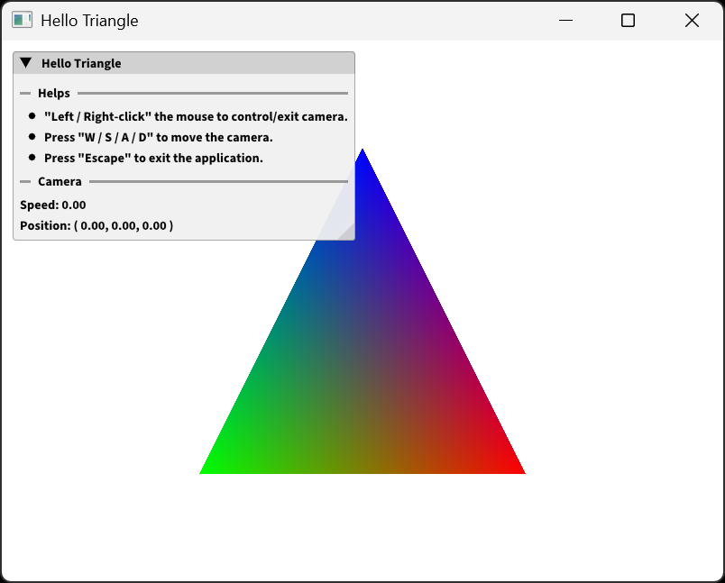

# Cabin

**Cabin** is a grahpics sandbox framework based on OpenGL.

## Showcase



For more samples, please check [sandbox](sandbox).

## Requirements

- Windows or Linux
- GPU with `OpenGL 4.6` support.
- Compiler with `C++20` supports.
- [xmake](https://github.com/xmake-io/xmake)

## Build & Run

1. Build from source:

```bash
xmake config -m release
xmake build
```

2. Run sandbox by specifying its name (check [details](sandbox)):

```bash
xmake run <target>
```

## Structure

- `src`: Source code of cabin framework.
- `sandbox`: Sandbox collections.

## Thirdparty

### Libraries

- **GLFW**: <https://github.com/glfw/glfw>
- **GLAD**: <https://github.com/Dav1dde/glad>
- **GLM**: <https://github.com/g-truc/glm>
- **stb**: <https://github.com/nothings/stb>
- **ImGui**: <https://github.com/ocornut/imgui>

### Assets

- **Source Sans**: <https://github.com/adobe-fonts/source-sans>

## References

- **LearnOpenGL-CN**: <https://learnopengl-cn.github.io>

## License

Licensed under the MIT license, check [LICENSE](LICENSE) for details.
