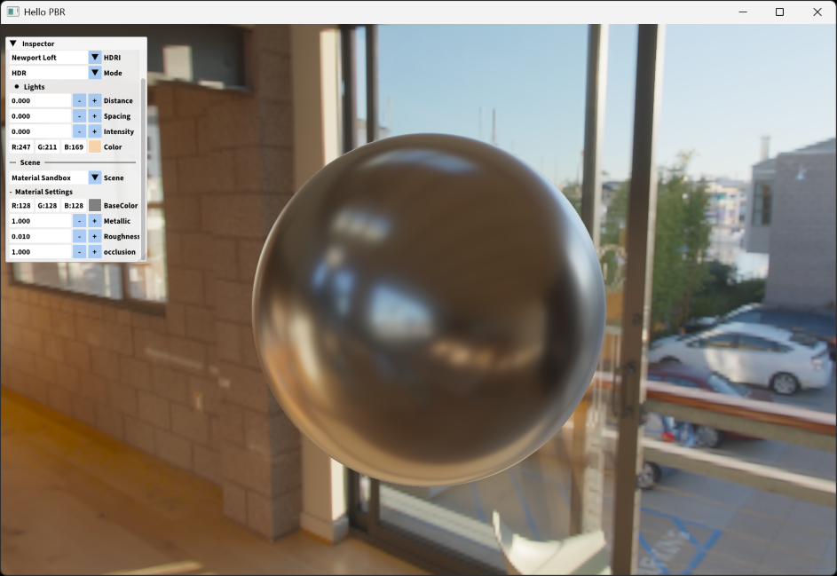

# Cabin

**Cabin** is a grahpics sandbox framework based on OpenGL.

## Showcase



For the manual and more samples, please check sandbox [page](sandbox).

## Features

- OpenGL wrappers with Builder Pattern.

```cpp
using namespace cabin;

struct alignas(4) Vertex {
    glm::vec3 position;
    glm::vec2 texCoord;
};
std::vector<Vertex> vertices { ... };

auto vertexBuffer = core::VertexBuffer::Builder()
                            .setBuffer(vertices.data(), vertices.size() * sizeof(Vertex), GL_STATIC_DRAW)
                            .addAttribute<float>(0, 3)
                            .addAttribute<float>(1, 2)
                            .build();
```

- Utilities objects (e.g. FPS-style Camera and glTF-model Loader).

## Requirements

- Windows or Linux
- GPU with `OpenGL 4.6` support
- Compiler with `C++20` support
- Latest [xmake](https://github.com/xmake-io/xmake)

## Build & Run

1. Build from source:

```bash
xmake config -m release
xmake build
```

2. Run sandbox by specifying its name (check [sandbox-list](sandbox)):

```bash
xmake run <target>
```

## Structure

- `src`: Source code of cabin framework.
- `sandbox`: Sample sandbox-apps.

## Thirdparty

### Libraries

- **GLFW**: <https://github.com/glfw/glfw>
- **GLAD**: <https://github.com/Dav1dde/glad>
- **GLM**: <https://github.com/g-truc/glm>
- **stb**: <https://github.com/nothings/stb>
- **ImGui**: <https://github.com/ocornut/imgui>
- **tinygltf**: <https://github.com/syoyo/tinygltf>

### Assets

- **Poly Haven**: <https://polyhaven.com>
- **Source Sans**: <https://github.com/adobe-fonts/source-sans>
- **glTF-Assets**: <https://github.com/KhronosGroup/glTF-Sample-Assets>

## References

- **LearnOpenGL**: <https://learnopengl.com>
- **LearnOpenGL-CN**: <https://learnopengl-cn.github.io>

## License

Licensed under the MIT license, check [LICENSE](LICENSE) for details.
