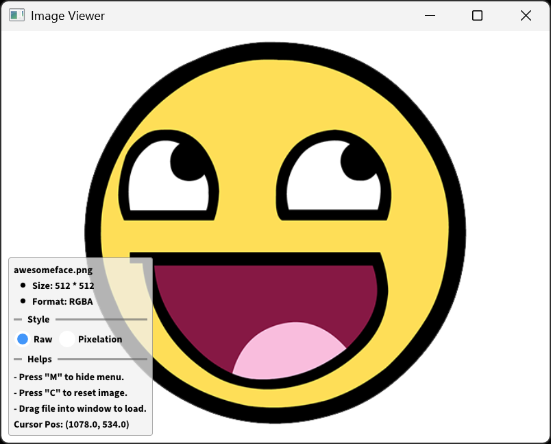
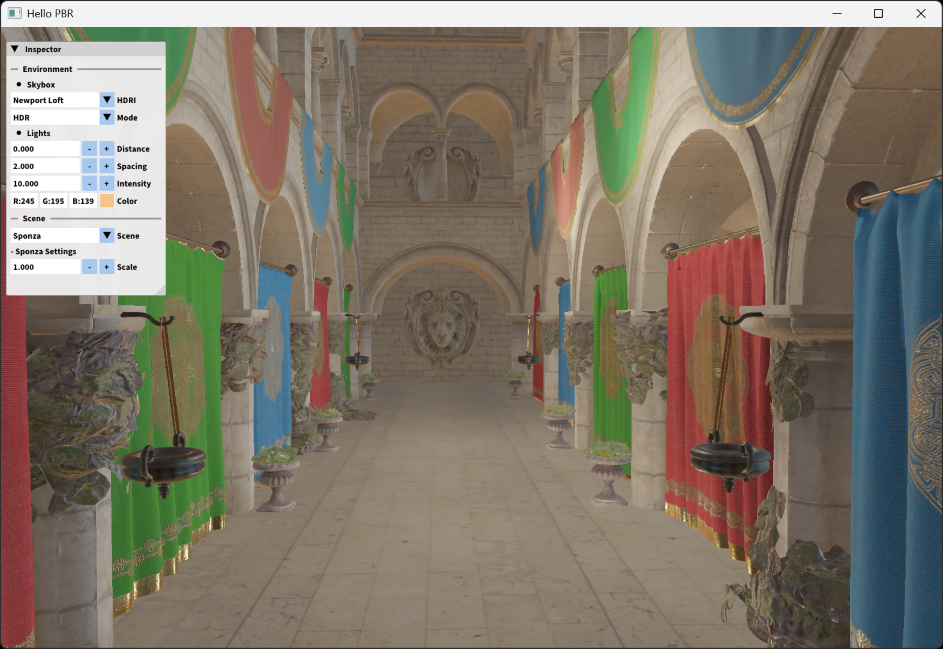

# Sandbox

The following is the list of sandbox-app examples.

Check [manual](MANUAL) to learn how to create your own sandbox-app.

## Hello Triangle

A sample application, showing how to create a graphics
sandbox-app with cabin framework.

Besides, you can also learn how to integrate ImGui and
`utils::Camera` into the sandbox-app.

- To Run `hello_triangle`:

```bash
xmake run hello_triangle
```


## Image Viewer

This simple image previewer shows how to pixelate images
with `core::FrameBuffer` and `core::Texture`.

- To Run `image_viewer`:

```bash
xmake run image_viewer
```



## Hello PBR

A **PBR** (Physically Based Rendering) showcase sandbox,
where you can learn:

1. Load **glTF** model with `utils::Model`.
2. Draw simple shpae with `utils::Shape`.
3. Load **HDR Image** with `core::Texture`.
4. Create skybox with `core::Texture` and `utils::Shape`.
5. Use `#![use("...")]` macro to share same GLSL code in different shaders.

- To Run `hello_pbr`:

```bash
xmake run hello_pbr
```



