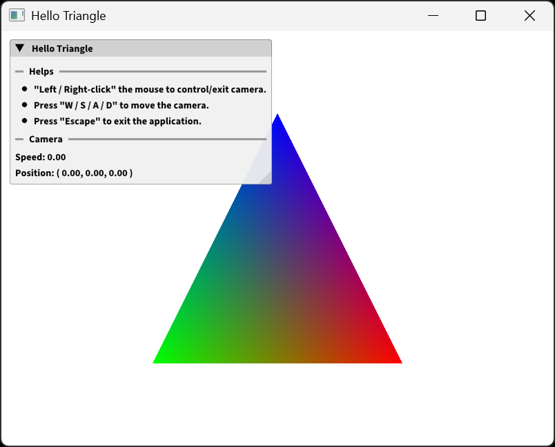
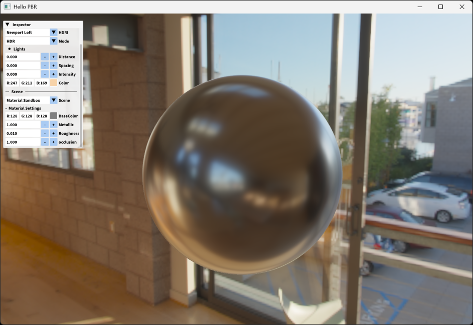
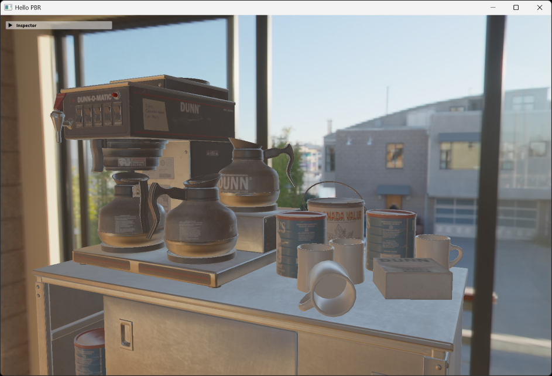

# Sandbox

## Hello Triangle

A sample application, showing how to create a graphics
sandbox-app with cabin framework.

Besides, you can also learn how to integrate ImGui and
`utils::Camera` into the sandbox-app.

- To Run `hello_triangle`:

```bash
xmake run hello_triangle
```



## Image Viewer

This simple image previewer shows how to pixelate images
with `core::FrameBuffer` and `core::Texture`.

```bash
xmake run image_viewer
```


## Hello PBR

A **PBR** (Physically Based Rendering) showcase sandbox,
where you can learn:

- Load **glTF** model with `utils::Model`.
- Draw simple shpae with `utils::Shape`.
- Load **HDR Image** with `core::Texture`.
- Create skybox with `core::Texture` and `utils::Shape`.
- Use `#![use("...")]` macro to share same GLSL code in different shaders.





